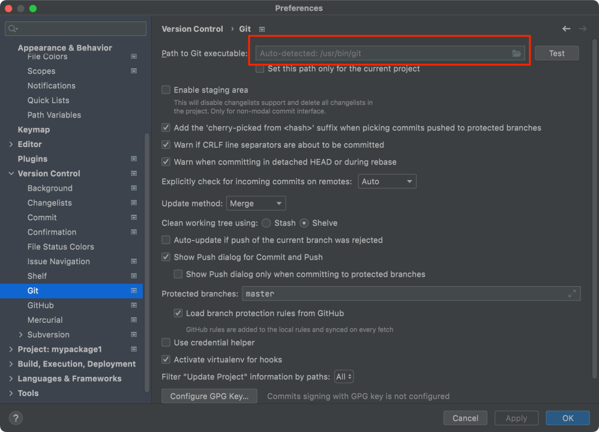
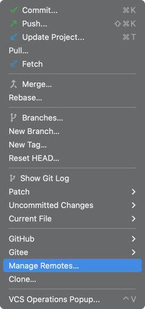
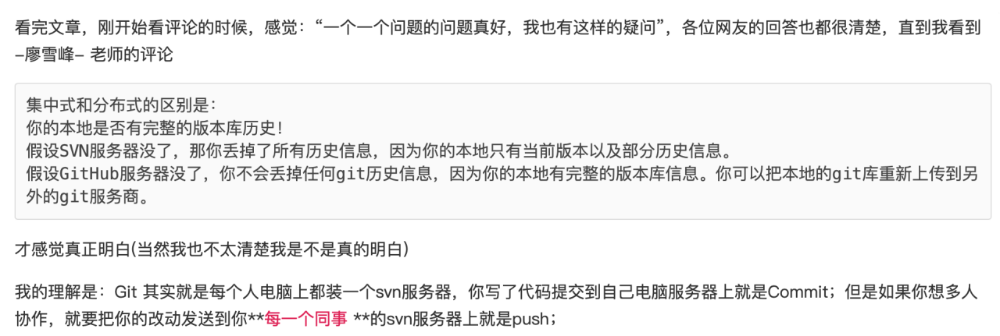
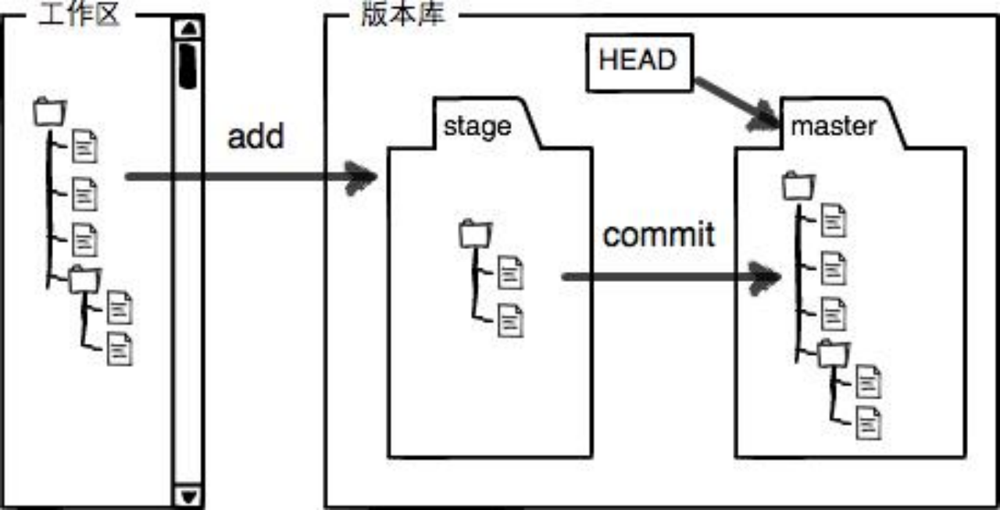

# git 操作

## git命令

* `git config --global user.name Leo Weng`基本配置
* `git config --global user.email wlaleo@stu.xjtu.edu.cn`基本配置
* `git config --list`  查看git的设置参数
* `git init`  在工作区初始化当前目录，把这个目录变成Git可以管理的仓库
* `git add`  把文件从工作区>>>>暂存区
* `git commit`  把文件从暂存区>>>>仓库
* `git status`  查看仓库当前的状态
* `git diff`  查看差异（具体看后文说明）
* `git log`  查看历史提交日志
* `git reset --hard HEAD^`  回退到上一个版本
* `git checkout -- readme.txt`  把readme.txt在工作区的修改全部撤销
* `git reset HEAD readme.txt`  把readme.txt在暂存区的修改全部撤销
* `git rm file`从版本库中删除文件
* `git remote add origin https://gitee.com/weng-longao/mypackage2.git`  添加远程仓库
* `git push -u origin main`  把本地main分支push到远程（远程分支默认名称就为origin），第一次推送加上 -u参数
* `git push origin main`  推送修改
* `git remote -v`  查看git远程仓库
* `git remote rm main`  删除远程仓库
* `git clone https://gitee.com/weng-longao/gitskills.git`  克隆远程仓库，直接在工作目录下克隆，会自动创建文件夹 ~/gitskills
* `git checkout -b dev`  创建dev分支，并且checkout到这个分支上，等于`git branch dev` 加上 `git checkout dev`
* `git merge dev`  合并dev分支到main（fast forward方法）
* `git branch -d dev`  删除dev分支
* `git branch -D dev`  在还有改动没合并的时候强制删除dev分支
* `git log --graph --pretty=oneline --abbrev-commit`  查看分支合并情况
* `git stash`  把当前工作现场“储藏”起来，等以后恢复现场后继续工作
* `git stash list`  查看储藏的工作现场
* `git cherry-pick 4c805e2`  复制4c805e2这个提交上的改动到当前分支
* `git stash pop`  恢复工作现场同时把stash的内容删除
* `git stash apply`  恢复工作现场，保留stash的内容
* `git stash drop`  删除stash的内容
* `git push origin dev`  把本地的开发分支push到远程
* `git checkout -b dev origin/dev`  pull远程的开发分支到本地

## git环境配置

### 1. 安装git，默认安装路径即可
### 2. pycharm中设置
### 3. pycharm中登录gitee
### 4. 添加远程仓库

### 5. 在pycharm中打开从远程克隆的仓库（即本地仓库），即可开始开发。

## 附录

### 1. git基本概念的理解

* git是一个分布式版本管理系统，github是git的中心服务商，作用是方便协同开发时的版本同步等。

### 2. macos系统隐藏文件的说明

### 3. git的本地结构

* Git管理的文件分为：工作区working dictionary，版本库repository，版本库又分为暂存区stage和暂存区分支master(仓库)

* 工作区>>>>暂存区>>>>仓库

* `git add`把文件从工作区>>>>暂存区，git commit把文件从暂存区>>>>仓库，

* `git diff`查看工作区和暂存区差异，

&emsp;&emsp;补充：git diff 分为两种情况：暂存区为空和暂存区不为空。
首先我们明确知道git diff是比较工作区和暂存区的文件的，如果此时暂存区为空，那么稍微有点不同，即： 
&emsp;&emsp;1. 暂存区为空使用git diff：因为此时暂存区为空，此时使用git diff同样也是比较工作区和仓库，即和使用git diff HEAD结果相同 
&emsp;&emsp;2. 暂存区不为空使用git diff:因为此时暂存区不为空，此时使用git diff比较的就是工作区和暂存区。

* `git diff --cached`查看暂存区和仓库差异，

* `git diff HEAD` 查看工作区和仓库的差异，

* `git add`的反向命令`git checkout`，撤销工作区修改，即把暂存区最新版本转移到工作区，

* `git commit`的反向命令`git reset HEAD`，就是把仓库最新版本转移到暂存区。

