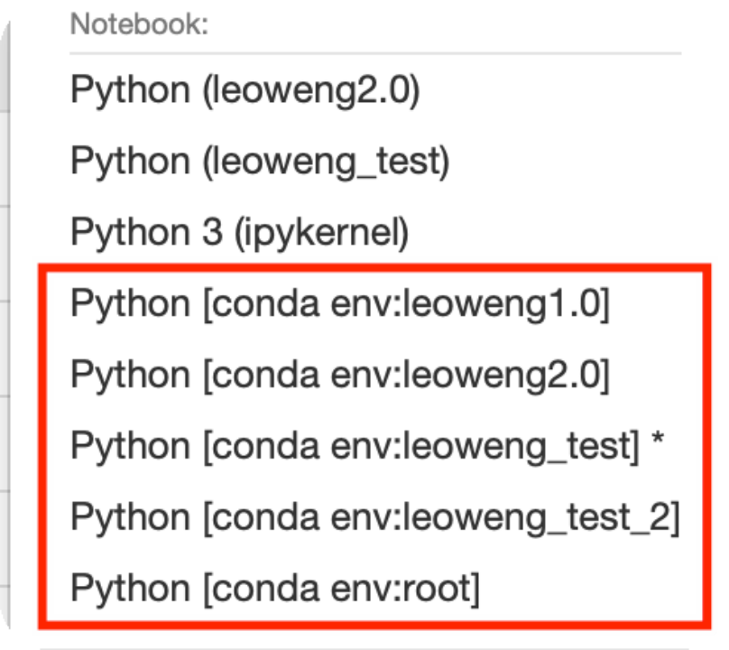
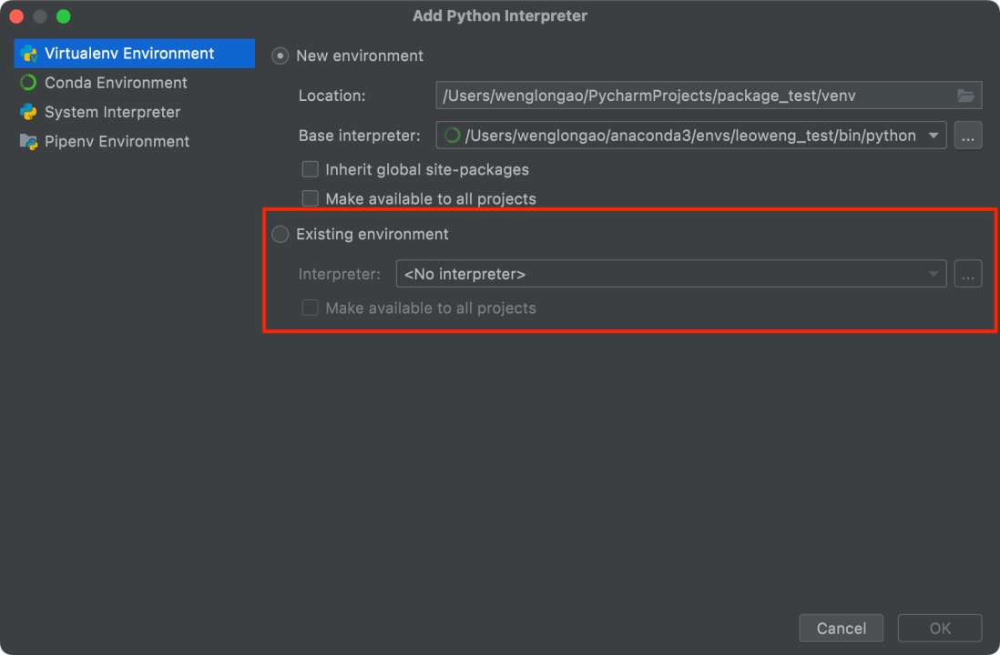
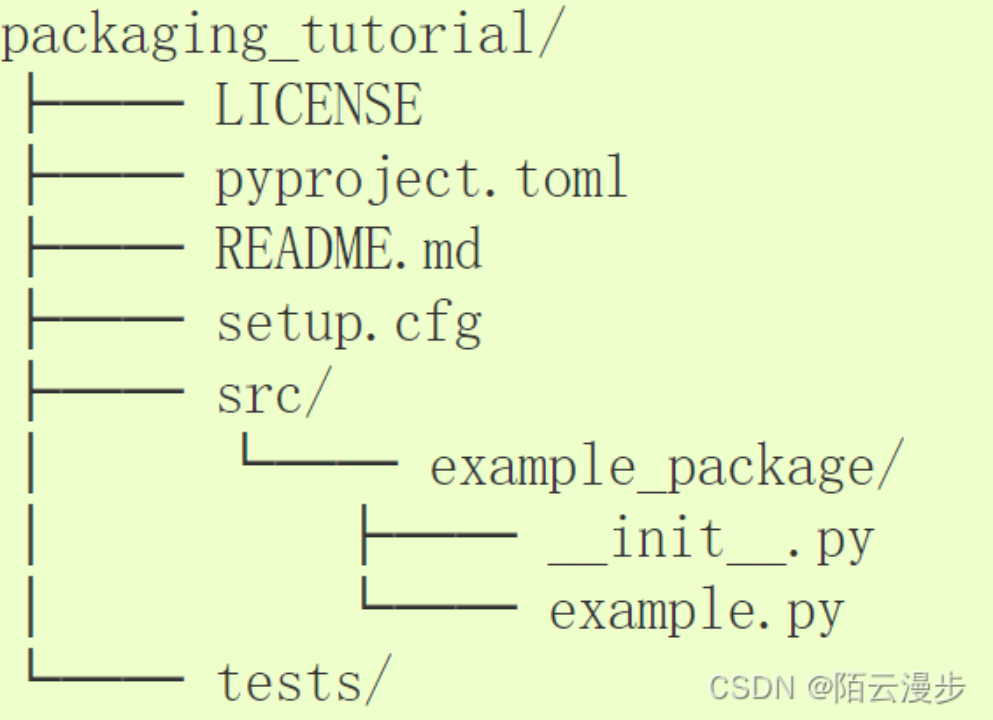
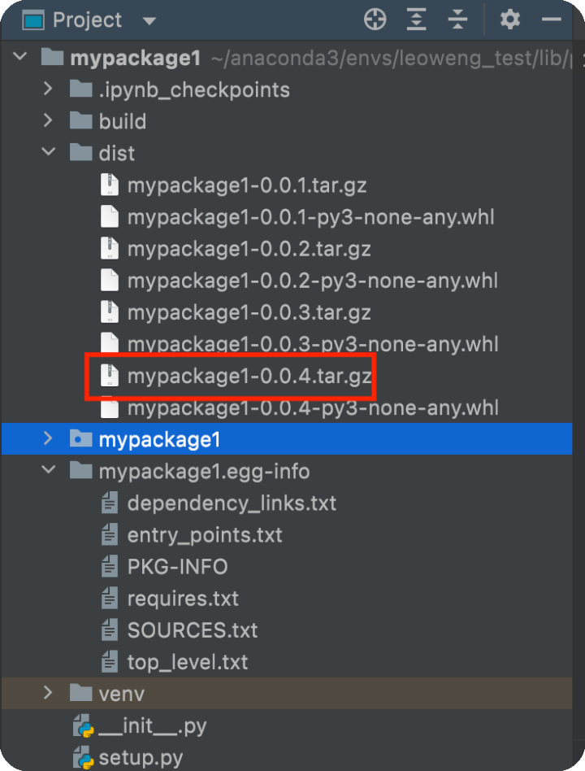
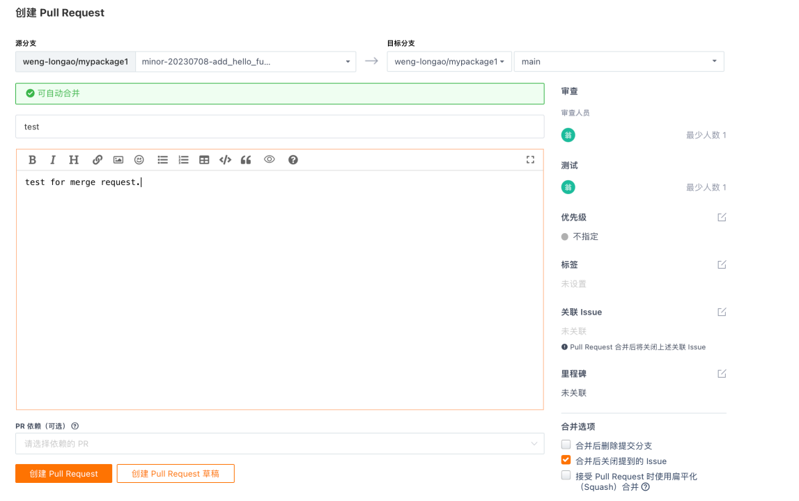
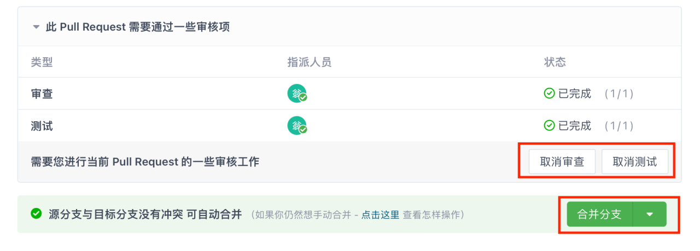

# 开发环境配置及开发流程

利用pycharm和anaconda搭建开发环境

## 1. 测试环境
在anaconda中创建测试环境leoweng_test，然后在jupyter notebook的kernel中加入测试环境，命名为leoweng_test，
这样就可以在notebook中对环境进行测试同时完成开发。
## 2. 生产环境
同样的步骤创建leowengx.x，目前为2.0版本（leoweng2.0）

[//]: # (* 为了避免环境被污染，最新的环境被clone一份，命名为leoweng_base)
[//]: # (* 以下为环境中python interpreter的路径示例：)

&emsp;&emsp;注意：以上通过python -m ipykernel install 命令手动将jupyter notebook的kernel连接到虚拟环境，可能会失效，
建议直接conda install nb_conda，然后重启notebook，notebook的kernel就会自动连接虚拟环境。conda env:开头的就是自动连接的，
有多少的虚拟环境都会自动创建对应个数的notebook kernel。

## 3. pycharm环境配置
&emsp;&emsp;在pycharm中，选取anaconda中的python interpreter，然后就可以通过pycharm的terminal来管理和操作anaconda中创建的环境。
check以下开头是否为虚拟环境名称：

在existing environment中添加创建好的虚拟环境（如leoweng_test）

## 4.在本地发布package
1. 打开pycharm，在site-package路径中创建新的project，命名为自己想要的包名称。这里指定site-package路径是为了能让site-package路径中具有
py文件，和其他package统一。创建好至少三个py文件，具体结构参考下图、psapmdata以及mypackage1。其中init文件的作用是使得
python interpreter知道这个路径下是python package，因此需要在每个py的同级目录下都放一个init文件，init文件可以为空（但是最好有import，
具体参考包和模块的说明）。setup文件的参数等参考下表

以及
<a href="https://blog.csdn.net/qq_39085138/article/details/124060979" target="_blank" rel="noopener">这篇blog</a>。 
2. 确保pycharm环境切换至想要发布package的环境，在pycharm terminal中输入python -m build（或者python setup.py bdist_wheel sdist），然后会看到生成一些文件，关注dist文件夹中的.tar.gz文件，代表着源码分发包，我们通常利用这个文件来install package。
3. 选择文件名称，运行pip install dist/mypackage1-0.0.4.tar.gz，此时package已经发布在本地，并且可以被pip识别。（pip list or pip show can be used for test.）
4. 如果迭代版本，那么需要在setup.py中修改版本号，然后再次重复步骤发布package。

5.git配置及利用git开发的流程
* 概述 假设我们从零开始开发，那么最好的步骤是先在远程创建一个仓库，然后克隆到本地，在本地完成开发后push到远程并且合并远程分支。

* 具体流程 
1.在远程手动创建一个仓库，添加README等文件。
2.创建git本地仓库（repo）路径 ~/work_repo。
3.在pycharm clone 远程仓库，选择本地仓库（directory）路径，配置python interpreter, checkout新的分支开始开发。 

4.开发完成后在pycharm中push，同时在gitee提交pull request。

5.审查和测试人员审核merge request, 并且合并分支。

6.在pycharm本地pull最新的远程main，本地main也被更新，完成远端仓库和本地仓库的更新。 
7.目前为止，本地的操作都是在repo中进行的，而本地环境中的相关package并没有更新。因此，最后我们更新本地环境中的package。首先，python -m build生成.tar.gz文件，然后在本地环境下install。例如，
pip install file://Users/wenglongao/work_repo/mypackage1/dist/mypackage1-0.0.5.tar.gz

参考文章 
<a href="https://blog.csdn.net/weixin_42345113/article/details/106444312">
https://blog.csdn.net/weixin_42345113/article/details/106444312</a>

https://blog.csdn.net/xx_xjm/article/details/128762190

https://blog.csdn.net/lslxdx/article/details/73131664

debug：
https://blog.csdn.net/donaldsy/article/details/103515752

发布package & setup.py reference：
https://blog.csdn.net/weixin_43940314/article/details/128349554

https://blog.csdn.net/weixin_49891576/article/details/129745519

包和模块的说明
https://blog.csdn.net/a15608445683/article/details/127926233

http://www.ujiuye.com/wenda/2023/72725.html