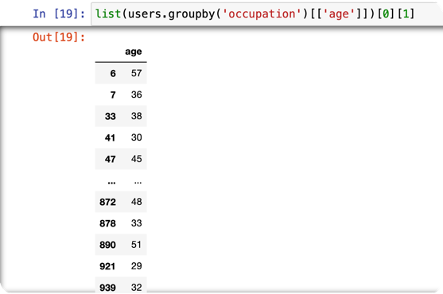
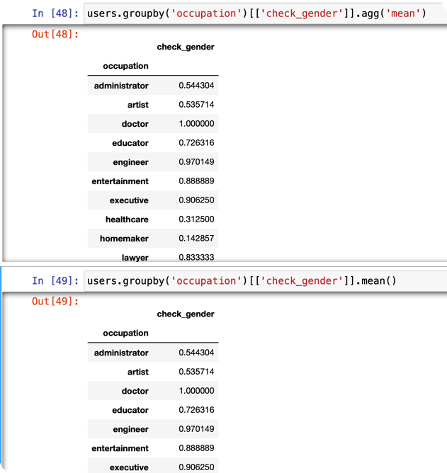

# pandas相关知识

## groupby

1. [机制详解](https://zhuanlan.zhihu.com/p/384256189)

    每一个groupby对象都可以当作是一个列表，列表里每个元素都是一个元组，每个元组包含两个元素，
分别为groupby的key和这个key对应的dataframe
2. groupby之后可以用`[['column_name']]`将特定的列拿出来，同时不改变groupby对象的结构
(都是DataFrameGroupBy)；`['column_name']`取出的对象结构是SeriesGroupBy
例如：

3. agg函数：用于聚合 本质上：agg里面的元素是一个dict，key代表要对df操作的columns，
没有key就默认所有的columns；value代表要操作的函数 ，可以是list结构。如果单独传入一个list，就代表
对所有的columns都采用了list里面的函数操作
4. 简洁写法：直接使用mean()等方法相当于对所有列都使用这个方法
两者等价。
5. 利用agg方法相当于对groupby对象的每一个group操作，然后再把结果聚合。
DataFrameGroupBy对象的每一个group操作完可以当作一个DataFrame
SeriesGroupBy对象的每一个group操作完可以当作一个SeriesGroupBy
* 重点：理解mean，sum，median，count等方法既可以对DataFrame操作也可以对Series操作

## 常用方法积累
1. [unstack函数](https://pythonjishu.com/pandas-dataframe-unstack/)
2. div方法
3. [applymap](https://blog.csdn.net/fengdu78/article/details/119496112)
将函数作用于dataframe的每一个元素
4. resample
例子见[datetime_relevant.ipynb](package_notebook_demo/datetime_relevant.ipynb) 
resample的rule参考[这个链接](https://pandas.pydata.org/pandas-docs/stable/user_guide/timeseries.html#dateoffset-objects)
[resample doc](https://pandas.pydata.org/pandas-docs/stable/reference/api/pandas.DataFrame.resample.html)
5. `df['column'].is_unique` 返回bool值，判断column中是否有重复元素
6. `df.sort_index(ascending=True)` 将df按照index升序排序
7. `wine.fillna({'alcohol': 10, 'magnesium': 100}, inplace=True)` fillna可以传入一个字典
8. `df['column'].value_counts().count()` 查看column中总共有几种元素，等价于`df['columns'].nunique()`
9. `df.values[18]` values方法可以得到某一行的所有属性
10. `df.loc[:, 'school': 'guardian']` loc方法也可以按照原先columns的顺序切片从一个column到另外一个column的df
11. [idxmax](https://pandas.pydata.org/pandas-docs/stable/reference/api/pandas.DataFrame.idxmax.html)
对于每个column，返回这个column最大的值所对应的index 
或者对于每个index，返回这个index最大的值对应的column
12. `df['owners'] = np.random.randint(low=15000, high=73001, size=cars.shape[0])` 常见的随机数column生成方法
13. `df.sort_index(ascending=True)` 按照index升序排序
14. `df.index.get_level_values(0)` 当df是multi-index的时候取出第一层index
