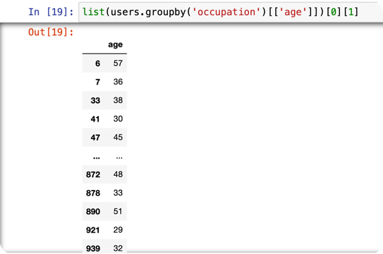
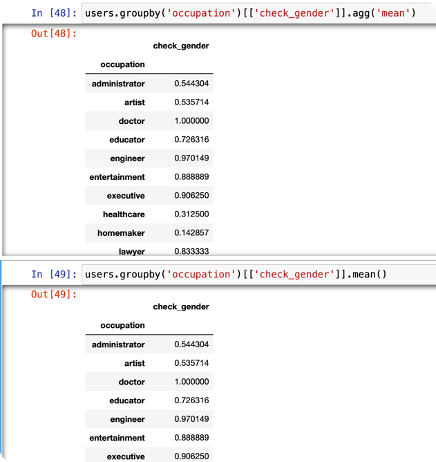

# pandas相关知识

## groupby

1. 机制详解见 https://zhuanlan.zhihu.com/p/384256189

    每一个groupby对象都可以当作是一个列表，列表里每个元素都是一个元组，每个元组包含两个元素，
分别为groupby的key和这个key对应的dataframe
2. groupby之后可以用[['column_name']]将特定的列拿出来，同时不改变groupby对象的结构
(都是DataFrameGroupBy)；['column_name']取出的对象结构是SeriesGroupBy
例如：

3. agg函数：用于聚合 本质上：agg里面的元素是一个dict，key代表要对df操作的columns，
没有key就默认所有的columns；value代表要操作的函数 ，可以是list结构
4. 简洁写法：直接使用mean()等方法相当于对所有列都使用这个方法
两者等价。
5. 利用agg方法相当于对groupby对象的每一个group操作，然后再把结果聚合。
DataFrameGroupBy对象的每一个group操作完可以当作一个DataFrame
SeriesGroupBy对象的每一个group操作完可以当作一个SeriesGroupBy
* 重点：理解mean，sum，median，count等方法既可以对DataFrame操作也可以对Series操作

## 高级方法
1. unstack函数 https://pythonjishu.com/pandas-dataframe-unstack/
2. div方法
3. applymap 
将函数作用于dataframe的每一个元素 https://blog.csdn.net/fengdu78/article/details/119496112
4. resample 
将